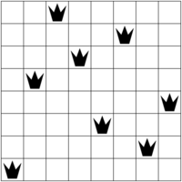
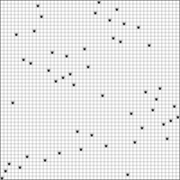
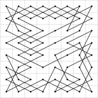
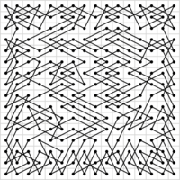

# CLP(ℤ) &mdash; Constraint Logic Programming over Integers

This repository contains information about **CLP(ℤ)**.

CLP(ℤ) requires **SICStus Prolog**.

The latest version of `library(clpz)` is available from:
[**metalevel.at/clpz.pl**](http://www.metalevel.at/clpz.pl)

The present implementation builds upon a decade of experience with a
precursor library which I developed for a different Prolog system.
CLP(ℤ) is the *more recent* and conceptually *more advanced*
implementation. To keep track of recent developments, use&nbsp;CLP(ℤ).

**Current developments**:

  - increase [**logical purity**](https://www.metalevel.at/prolog/purity) of the implementation
  - work on *stronger propagation*
  - *correct* all reported issues.
  - *add* new constraints.

CLP(ℤ) is being developed for inclusion in
[**GUPU**](http://www.complang.tuwien.ac.at/ulrich/gupu/).

An introduction to declarative integer arithmetic is available from
[**metalevel.at/prolog/clpz**](https://www.metalevel.at/prolog/clpz)

For more information about pure Prolog, read [**The Power of Prolog**](https://www.metalevel.at/prolog).

## Using CLP(ℤ) constraints

CLP(ℤ) is an instance of the general CLP(*X*) scheme, extending logic
programming with reasoning over specialised domains.

In the case of CLP(ℤ), the domain is the set of **integers**. CLP(ℤ)
is a generalisation of CLP(FD), which already ships with
SICStus&nbsp;Prolog.

CLP(ℤ) constraints like `(#=)/2`, `(#\=)/2`, and `(#<)/2` are meant
to be used as pure alternatives for lower-level arithmetic primitives
over integers. Importantly, they can be used in *all directions*.

For example, consider a rather typical definition of `n_factorial/2`:

    n_factorial(0, 1).
    n_factorial(N, F) :-
            N #> 0,
            N1 #= N - 1,
            n_factorial(N1, F1),
            F #= N * F1.

CLP(ℤ) constraints allow us to quite *freely exchange* the order
of&nbsp;goals, obtaining for example:

    n_factorial(0, 1).
    n_factorial(N, F) :-
            N #> 0,
            N1 #= N - 1,
            F #= N * F1,
            n_factorial(N1, F1).

This works in all directions, for example:

    ?- n_factorial(47, F).
    258623241511168180642964355153611979969197632389120000000000 ;
    false.

and also:

    ?- n_factorial(N, 1).
    N = 0 ;
    N = 1 ;
    false.

and also in the most general case:

    ?- n_factorial(N, F).
    N = 0,
    F = 1 ;
    N = F, F = 1 ;
    N = F, F = 2 ;
    N = 3,
    F = 6 .

The advantage of using `(#=)/2` to express *arithmetic equality* is
clear: It is a more general alternative for lower-level predicates.

In addition to providing declarative integer arithmetic,
CLP(ℤ)&nbsp;constraints are also often used to solve
[**combinatorial&nbsp;tasks**](https://www.metalevel.at/prolog/optimization)
with&nbsp;Prolog.

## Example programs

This repository contains several example programs. The main predicates
are all completely pure and can be used as true relations. This means
that you can use the *same* program to:

* *find* a single solution
* *enumerate* all solutions
* *complete* partially instantiated solutions
* *validate* fully instantiated solutions.

To get an idea of the power, usefulness and scope of CLP(ℤ)
constraints, I recommend you work through the examples in the
following order:

1. [**n_factorial.pl**](n_factorial.pl): Shows how to use CLP(ℤ)
   constraints for **declarative integer arithmetic**, obtaining very
   general programs that can be used in all directions. Declarative
   integer arithmetic is the simplest and most common use of CLP(ℤ)
   constraints. They are easy to understand and use this way, and
   often increase generality and logical purity of your code.

2. [**sendmory.pl**](sendmory.pl): A simple cryptoarithmetic puzzle.
   The task is to assign one of the digits 0,...,9 to each of the
   letters S,E,N,D,M,O,R and Y in such a way that the following
   calculation is valid, and no leading zeroes appear:

            S E N D
          + M O R E
          ---------
        = M O N E Y

   This example illustrates several very important concepts:

   * It is the first example that shows **residual constraints** for the
     most general query. They are equivalent to the original query.

   * It is good practice to separate the **core relation** from
     `labeling/2`, so that termination and determinism can be observed
     without an expensive search for concrete solutions.

   * You can use this example to illustrate that the CLP(ℤ) system is able
     to **propagate** many things that can also be found with human
     reasoning. For example, due to the nature of the above calculation and
     the prohibition of leading zeroes, `M` is necessarily 1.

3. [**sudoku.pl**](sudoku.pl): Uses CLP(ℤ) constraints to model and
   solve a simple and well-known puzzle. This example is well suited
   for understanding the impact of different **propagation
   strengths**: Use it to compare `all_different/1` `all_distinct/1`
   on different puzzles:

      

   The small dots in each cell indicate how many elements are pruned
   by different **consistency techniques**. In many Sudoku puzzles,
   using `all_distinct/1` makes labeling unnecessary. Does this mean that
   we can forget `all_different/1` entirely?

   **Video**: https://www.metalevel.at/prolog/videos/sudoku

4. [**magic_square.pl**](magic_square.pl): CLP(ℤ) formulation of [*magic
   squares*](http://mathworld.wolfram.com/MagicSquare.html). This is a good
   example to learn about **symmetry breaking** constraints: Consider how
   you can eliminate solutions that are rotations, reflections etc. of
   other solutions, by imposing suitable further constraints. For example,
   the following two solutions are essentially identical, since one can be
   obtained from the other by reflecting elements along the main diagonal:

      

   Can you impose additional constraints so that you get only a single
   solution in such cases, without losing any solutions that do not
   belong to the same equivalence class? How many solutions are there
   for N=4 that are unique up to isomorphism?

5. [**magic_hexagon.pl**](magic_hexagon.pl): Uses CLP(ℤ) to describe a
   [*magic hexagon*](http://mathworld.wolfram.com/MagicHexagon.html) of
   order 3. The task is to place the integers 1,...,19 in the following
   grid so that the sum of all numbers in a straight line (there are lines
   of length 3, 4 and 5) is equal to 38. One solution of this task is shown
   in the right picture:

      

   This is an example of a task that looks very simple at first, yet
   is almost impossibly hard to solve manually. It is easy to solve
   with CLP(ℤ) constraints though. Use the constraint solver to show
   that the solution of this task is unique up to isomorphism.

6. [**n_queens.pl**](n_queens.pl): Model the so-called [*N-queens
   puzzle*](https://en.wikipedia.org/wiki/Eight_queens_puzzle) with
   CLP(ℤ) constraints. This example is a good candidate to experiment
   with different **search strategies**, specified as options of
   `labeling/2`. For example, using the labeling strategy `ff`, you
   can easliy find solutions for 100 queens and more. Sample solutions
   for 8 and 50 queens:

      

   Try to find solutions for larger N. Reorder the variables so that
   `ff` breaks ties by selecting more central variables first.

   **Video**: https://www.metalevel.at/prolog/videos/n_queens

7. [**knight_tour.pl**](knight_tour.pl): Closed Knight's Tour using
   CLP(ℤ) constraints. This is an example of using a more complex
   **global constraint** called `circuit/1`. It shows how a problem
   can be transformed so that it can be expressed with a global
   constraint. Sample solutions, using an 8x8 and a 16x16 board:

      

   Decide whether `circuit/1` can also be used to model tours that are
   not necessarily closed. If not, why not? If possible, do it.

8. [**tasks.pl**](tasks.pl): A task scheduling example, using the
   `cumulative/2` global constraint. The `min/1` labeling option is
   used to minimize the total duration.

    

## Animations

When studying Prolog and CLP(ℤ) constraints, it is often very useful
to show *animations* of search processes. An instructional example:

[**N-queens animation**](https://www.metalevel.at/queens/): This
visualizes the search process for the N-queens example.

You can use similar PostScript instructions to create [custom
animations](https://www.metalevel.at/postscript/animations) for
other examples.

## An impure alternative: Low-level integer arithmetic

Suppose for a moment that CLP(ℤ) constraints were not available in
your Prolog system, or that you do not want to use them. How do we
formulate `n_factorial/2` with more primitive integer arithmetic?

In our first attempt, we simply replace the declarative CLP(ℤ)
constraints by lower-level arithmetic predicates and obtain:

    n_factorial(0, 1).
    n_factorial(N, F) :-
            N > 0,
            N1 is N - 1,
            F is N * F1,
            n_factorial(N1, F1).

Unfortunately, this does not work at all, because lower-level
arithmetic predicates are *moded*: This means that their arguments
must be sufficiently instantiated at the time they are invoked.
Therefore, we must reorder the goals and&nbsp;&mdash; somewhat
annoyingly&nbsp;&mdash; change this for example to:

    n_factorial(0, 1).
    n_factorial(N, F) :-
            N > 0,
            N1 is N - 1,
            n_factorial(N1, F1),
            F is N * F1.

Naive example queries inspired more by *functional* than by
*relational* thinking may easily mislead us into believing that this
version is working correctly:

    ?- n_factorial(6, F).
    F = 720 ;
    false.

Another example:

    ?- n_factorial(3, F).
    F = 6 ;
    false.

But what about *more general* queries? For example:

    ?- n_factorial(N, F).
    N = 0,
    F = 1 ;
    ERROR: n_factorial/2: Arguments are not sufficiently instantiated

Unfortunately, this version thus cannot be directly used to enumerate
more than one solution, which is another severe drawback in comparison
with the pure version.

You can make the deficiency a lot worse by arbitrarily adding
a&nbsp;`!/0` somewhere. Using `!/0` is a quite reliable way to destroy
almost all declarative properties of your code in most cases, and this
example is no exception:

    n_factorial(0, 1) :- !.
    n_factorial(N, F) :-
            N > 0,
            N1 is N - 1,
            n_factorial(N1, F1),
            F is N * F1.

This version appears in several places. The fact that the following
interaction *incorrectly* tells us that there is exactly one solution of
the factorial relation is apparently no cause for concern there:

    ?- n_factorial(N, F).
    N = 0,
    F = 1.

Zero and one are the only important integers in any case, if you are
mostly interested in programming at a very low level.

For more usable and general programs, I therefore recommend you stick
to CLP(ℤ) constraints for integer arithmetic. You can place pure
goals in any order without changing the declarative meaning of your
program, just as you would expect from logical conjunction. For
example:

    n_factorial(0, 1).
    n_factorial(N, F) :-
            N #> 0,
            N1 #= N - 1,
            n_factorial(N1, F1),
            F #= N * F1.

Reordering pure goals can change **termination properties**, but it
cannot incorrectly lead to failure where there is in fact a solution.
Therefore, we get with the above CLP(ℤ) version for example:

    ?- n_factorial(N, 3).
    <loops>

And now we can reason completely declaratively about the code: Knowing
that (a)&nbsp;CLP(ℤ) constraints are *pure* and can thus be reordered
quite liberally and (b)&nbsp;that posting CLP(ℤ) constraints *always
terminates*, we *know* that placing CLP(ℤ) constraints earlier can at
most *improve*, never *worsen* the desirable termination properties.

Therefore, we change the definition to the version shown initially:

    n_factorial(0, 1).
    n_factorial(N, F) :-
            N #> 0,
            N1 #= N - 1,
            F #= N * F1,
            n_factorial(N1, F1).

The sample query now terminates:

    ?- n_factorial(N, 3).
    false.

Using CLP(ℤ) constraints has allowed us to improve the termination
properties of this predicate by purely declarative reasoning.

## Acknowledgments

I am extremely grateful to:

[**Ulrich Neumerkel**](http://www.complang.tuwien.ac.at/ulrich/), who
introduced me to constraint logic programming.

[**Nysret Musliu**](http://dbai.tuwien.ac.at/staff/musliu/), my thesis
advisor, whose interest in combinatorial tasks and constraint
satisfaction highly motivated me to work in this area.

[**Mats Carlsson**](https://www.sics.se/~matsc/), the designer and
main implementor of SICStus Prolog and its superb [CLP(FD)
library](https://sicstus.sics.se/sicstus/docs/latest4/html/sicstus.html/lib_002dclpfd.html#lib_002dclpfd)
which spawned my interest in constraints.
